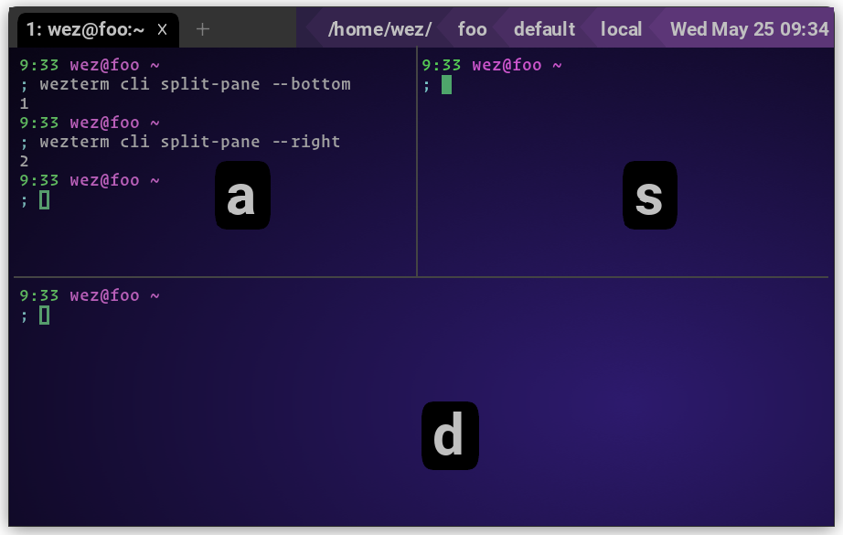

# PaneSelect

*Since: 20220624-141144-bd1b7c5d*

This action activates the pane selection modal display. In this mode, each pane
will be overlayed with a one- or two-character label taken from the selection
alphabet.



Typing the label will select the pane, take an action and exit selection mode.
Pressing `Escape` or `CTRL-g` will exit pane selection mode without taking any
action.

The available actions are:

* `mode="Activate"` - activate the selected pane. This is the default mode.
* `mode="SwapWithActive"` - swap the position of the active pane with the selected pane

The selection alphabet defaults to the same value as [quick_select_alphabet](../config/quick_select_alphabet.md), but can be explicitly via the `alphabet` field:

```lua
local wezterm = require 'wezterm'
local act = wezterm.action

return {
  -- 36 is the default, but you can choose a different size.
  -- Uses the same font as window_frame.font
  -- pane_select_font_size=36,

  keys = {
    -- activate pane selection mode with the default alphabet (labels are "a", "s", "d", "f" and so on)
    { key = '8', mods = 'CTRL', action = act.PaneSelect },
    -- activate pane selection mode with numeric labels
    {
      key = '9',
      mods = 'CTRL',
      action = act.PaneSelect {
        alphabet = '1234567890',
      },
    },
    -- show the pane selection mode, but have it swap the active and selected panes
    {
      key = '0',
      mods = 'CTRL',
      action = act.PaneSelect {
        mode = 'SwapWithActive',
      },
    },
  },
}
```

See also [RotatePanes](RotatePanes.md).
